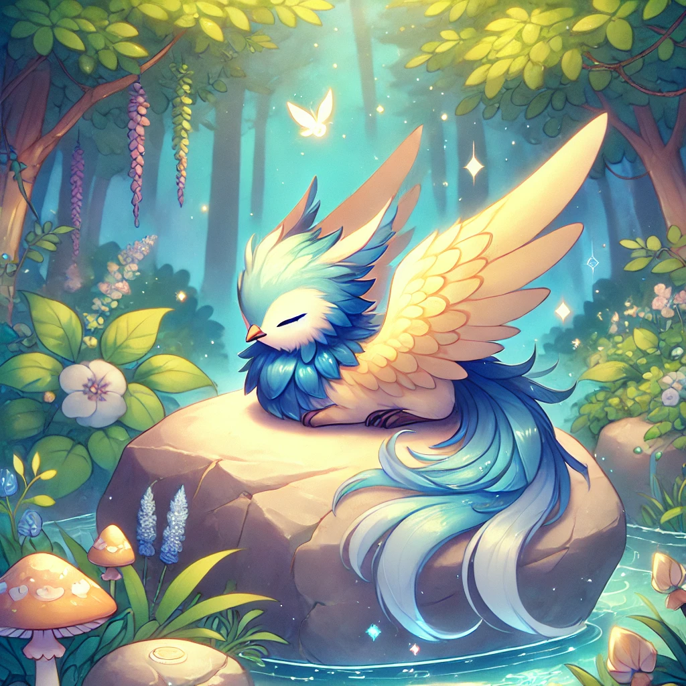

# Bri 

Hi, I'm pretty much new to coding. I'm interested in learning more about Web Development and Python. I've had a very basic introduction to HTML/CSS, Java, & Processing in the past. Other interests: 3D/2D Animation , Illustration, UX Design, QA Testing 

### Hobbies

- Cats  🐈‍⬛
- Gardening
- Cooking
- 日本語
    - Anime
    - Manga
- Reading

[OpenLibrary](https://openlibrary.org/)
